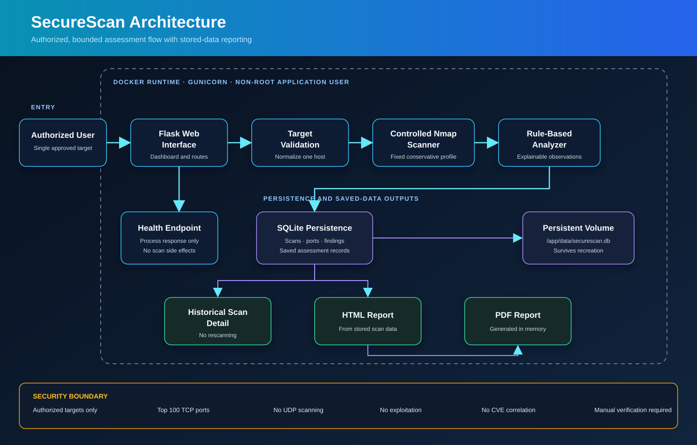
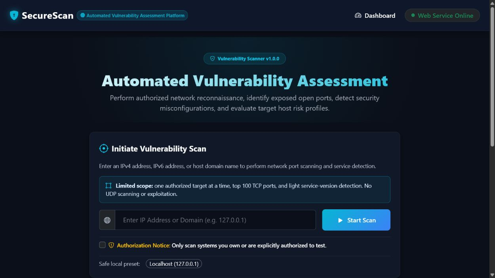
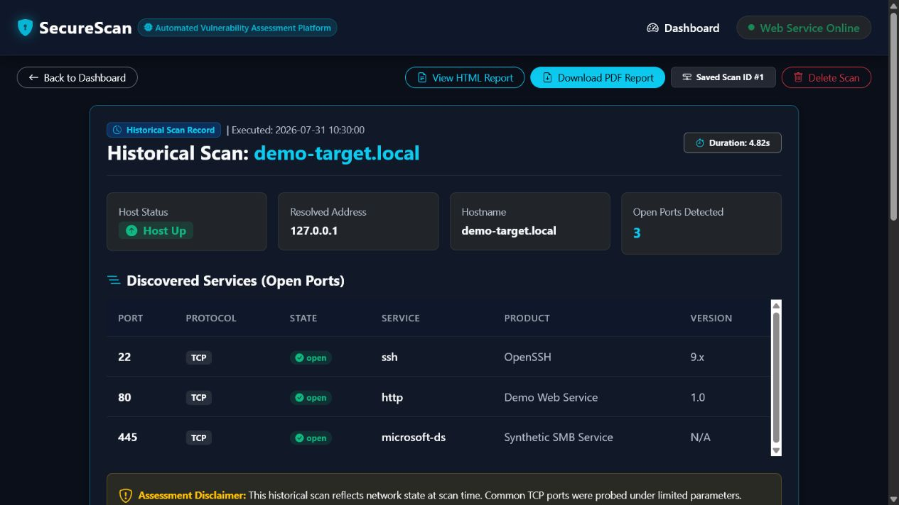
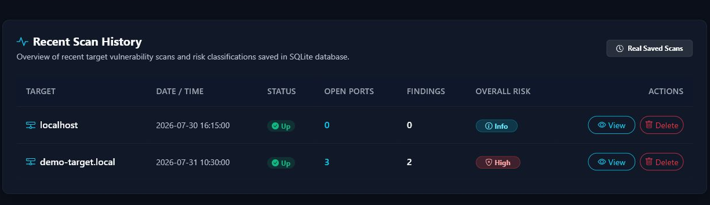
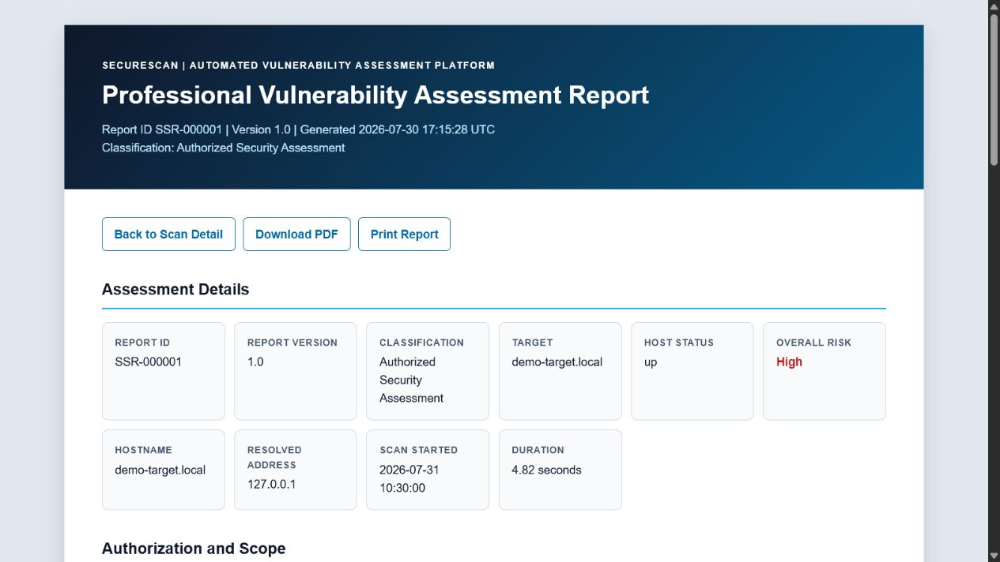
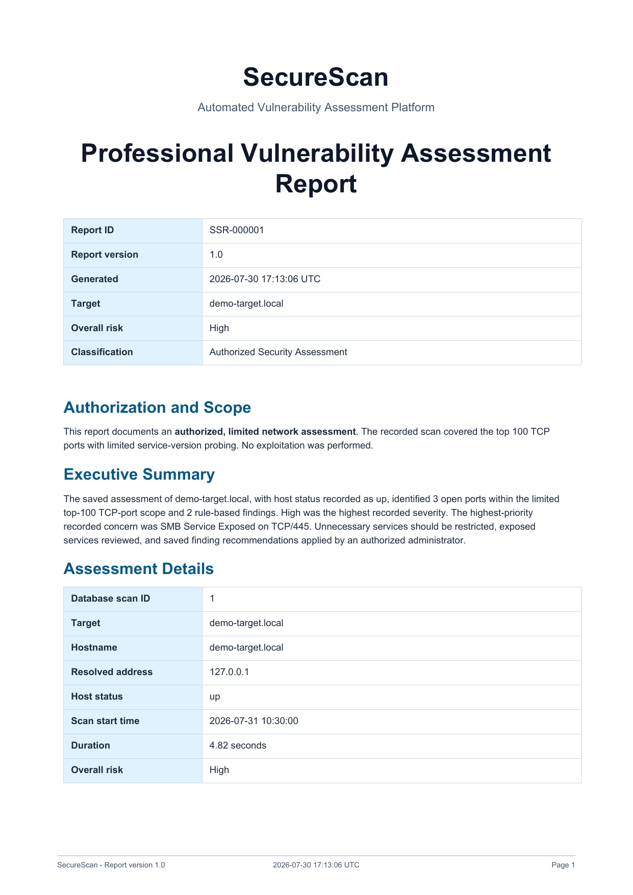

# SecureScan

> **Stable portfolio release: v1.0.0**

> A Flask-based, authorized vulnerability assessment platform that performs
> controlled Nmap service discovery, applies transparent rule-based security
> checks, preserves scan history in SQLite, and produces professional HTML and
> PDF reports.

---

## Professional Portfolio Project

SecureScan demonstrates an end-to-end security engineering workflow: validated
target input, bounded network reconnaissance, explainable findings, persistent
assessment history, report generation, automated testing, and hardened Docker
deployment.

It is designed for security students, junior security professionals, developers,
and technical reviewers who want to examine a practical, safety-conscious
vulnerability assessment application.

> [!IMPORTANT]
> SecureScan must only be used against systems you own or have explicit
> authorization to assess. The application requires users to confirm
> authorization before a scan can begin.

## Release Status

SecureScan v1.0.0 is the stable portfolio release. See the
[changelog](CHANGELOG.md) for delivered capabilities, security decisions, and
known limitations.

The application version is `1.0.0`. Reports use a separate internal
report-format version, currently `1.0`, to identify their schema and layout;
the report-format version is not the application release version.

## Key Features

- Validates and normalizes a single IPv4 address, IPv6 address, hostname, or
  `localhost` target.
- Rejects URLs, CIDR ranges, embedded ports, shell metacharacters, and other
  unsupported target formats.
- Runs a fixed, conservative Nmap profile against the top 100 TCP ports:
  `-sV --top-ports 100 --version-light -T3`.
- Parses host status, resolved addresses, hostname, open ports, services,
  products, and detected versions.
- Applies transparent, deterministic rules to saved service observations.
- Assigns severity, confidence, evidence, and remediation guidance to findings.
- Stores scans, open ports, and findings in SQLite.
- Displays recent scans and detailed historical results.
- Generates professional HTML and in-memory PDF reports from stored scan data.
- Provides a side-effect-free process health endpoint.
- Includes a multi-stage Docker build, Gunicorn, a non-root runtime user,
  health checks, and persistent database storage.
- Includes 85 automated tests with scanner activity mocked.

## Technology Stack

| Area | Technology |
| --- | --- |
| Application | Python 3, Flask, Jinja2 |
| Network discovery | Nmap and `python-nmap` |
| Security analysis | Custom rule-based analyzer |
| Persistence | SQLite |
| Reporting | HTML/CSS and ReportLab |
| Front end | Bootstrap 5, Bootstrap Icons, custom CSS |
| Production server | Gunicorn |
| Deployment | Docker and Docker Compose |
| Testing | Python `unittest` and `unittest.mock` |

## Architecture Overview



New assessments follow the validation, scanning, analysis, and persistence path.
Historical detail and report routes load existing SQLite records; they do not
rerun Nmap or the analyzer.

## Folder Structure

```text
SecureScan/
├── backend/                 # Flask application, configuration, and routes
├── database/                # SQLite access layer and schema
├── docs/                    # Architecture and sanitized portfolio images
├── reports/                 # Report normalization and PDF generation
├── scanner/                 # Target validation and Nmap integration
├── static/                  # Custom CSS and static asset directories
├── templates/               # Dashboard, history, and HTML report templates
├── tests/                   # Automated unit and route tests
├── vulnerability/           # Rule definitions and analysis engine
├── .dockerignore
├── .env.example
├── .gitignore
├── docker-compose.yml
├── Dockerfile
├── requirements.txt
└── README.md
```

## Installation (Local Python)

### Prerequisites

- Python 3.11 or newer
- Nmap installed as a separate system executable and available on `PATH`
- Git

`python-nmap` is a Python wrapper and is not a replacement for the Nmap
executable.

### Setup

```powershell
git clone https://github.com/Harsh-vardhaan/SecureScan.git
Set-Location SecureScan
python -m venv .venv
.\.venv\Scripts\Activate.ps1
python -m pip install --upgrade pip
python -m pip install -r requirements.txt
```

For macOS or Linux, activate the environment with:

```bash
source .venv/bin/activate
```

Install Nmap using the official installer or your operating system's package
manager, then verify that the `nmap` executable is available on `PATH`.

## Installation (Docker)

Docker Desktop on Windows must be running with Linux containers enabled.
The image installs both the `python-nmap` wrapper and the Linux Nmap executable.
Compose builds the runtime image with the release-oriented tag
`securescan:1.0.0`.

Set a strong Flask session secret before starting Compose:

```powershell
$env:SECRET_KEY = '<generate-a-long-random-value>'
docker compose up --build -d
```

PowerShell environment variables do not persist into new terminal sessions.
Set `SECRET_KEY` again in each new session before using Compose.

Alternatively, create a local environment file:

```powershell
Copy-Item .env.example .env
# Replace the placeholder in .env with a strong random value.
docker compose up --build -d
```

The local `.env` file is ignored by Git and must never be committed.

Open the application at <http://127.0.0.1:5001> and check process health at
<http://127.0.0.1:5001/health>.

Stop the service without deleting saved scan history:

```powershell
docker compose down
```

SQLite data is stored in the named `securescan-data` volume and survives normal
container recreation. Running `docker compose down -v` deletes that volume and
its saved database.

## Environment Variables

| Variable | Purpose | Default |
| --- | --- | --- |
| `SECRET_KEY` | Signs Flask session data and flash messages | Development-only fallback when running locally; required by Compose |
| `SECURESCAN_DATABASE_PATH` | Overrides the SQLite database path | Project database path locally; `/app/data/securescan.db` in Docker |
| `SECURESCAN_HOST` | Local Flask development-server bind address | `127.0.0.1` |
| `SECURESCAN_PORT` | Local Flask development-server port | `5000` |
| `SECURESCAN_DEBUG` | Enables local Flask debug mode for `1`, `true`, `yes`, or `on` | Disabled |

The built-in fallback `SECRET_KEY` is for isolated local development only.
Always supply a strong secret for shared, containerized, or exposed deployments.

## Running the Application

With the virtual environment active and Nmap available:

```powershell
$env:SECRET_KEY = '<generate-a-long-random-value>'
python -m backend.app
```

The local development server listens on <http://127.0.0.1:5000> by default.
Container deployments use Gunicorn and expose the application on host port
`5001`.

The `/health` endpoint confirms that the Flask/Gunicorn process can respond. It
does not test database writes, Nmap availability, scanner privileges, or target
reachability.

## Running Tests

The test suite uses isolated temporary databases and mocked scanner calls. It
does not perform real network scans.

```powershell
python -m unittest discover -s tests -p "test_*.py"
python -m compileall backend scanner vulnerability database reports
```

The current suite contains 85 tests covering validation, analysis, persistence,
Flask routes, saved reports, PDF generation, and Docker configuration.

## Docker Testing

Validate the Compose configuration with a temporary secret:

```powershell
$env:SECRET_KEY = '<temporary-test-value>'
docker compose config --quiet
```

Build the dedicated test stage and run its default test command:

```powershell
docker build --target test -t securescan:test .
docker run --rm securescan:test
```

No real Nmap target should be scanned during automated testing.

## Continuous Integration

GitHub Actions runs the unit suite on Python 3.11, 3.12, and 3.13, compiles the
Python application packages, validates the Docker Compose configuration, and
builds and executes the Docker test-stage image. CI uses synthetic environment
values and temporary database storage. Scanner calls remain mocked, so the
workflow does not perform real Nmap scans or contact scan targets.

## Contributing

Contributions are welcome when they preserve SecureScan's authorized-use and
bounded-scanning design. Review [CONTRIBUTING.md](CONTRIBUTING.md) for setup,
testing, security, privacy, and pull-request expectations.

## Example Workflow

1. Start SecureScan locally or with Docker.
2. Enter one IP address or hostname.
3. Confirm that you own the target or have explicit permission to assess it.
4. SecureScan validates and normalizes the target.
5. Nmap performs limited service discovery across the top 100 TCP ports.
6. The analyzer applies rule-based observations to the parsed scan result.
7. The scan, open ports, and findings are saved to SQLite.
8. Review the result on the dashboard or open its historical detail page.
9. Generate an HTML report or download an in-memory PDF from the saved record.

Opening a historical scan or report never triggers another scan and never reruns
the analyzer.

## Security Design Decisions

- **Explicit authorization:** The scan route requires an authorization
  confirmation before execution.
- **Single-target validation:** Network ranges, URLs, embedded ports, and shell
  syntax are rejected.
- **Fixed scan profile:** Users cannot inject arbitrary Nmap arguments.
- **Bounded scope:** Scanning is limited to the top 100 TCP ports with light
  service-version probing.
- **No exploitation:** SecureScan performs observation and analysis only.
- **Explainable analysis:** Findings originate from visible, deterministic rules
  rather than opaque scoring or exploit attempts.
- **Stored-data reporting:** HTML and PDF reports use persisted scan records and
  do not create new network activity.
- **Non-root container:** The production image runs as the dedicated
  `securescan` user.
- **Local-only published port:** Compose binds the application to
  `127.0.0.1:5001`.
- **Secret separation:** Runtime secrets are supplied through the environment and
  local `.env` files are ignored.
- **Test isolation:** Scanner calls are mocked and test databases are temporary.

## Current Limitations

- Scans only the top 100 TCP ports.
- Does not perform UDP scanning.
- Does not perform authenticated scanning.
- Does not exploit services or validate exploitability.
- Does not query a CVE database or external threat-intelligence service.
- Findings are rule-based observations and may require manual verification.
- Service detection depends on the information returned by Nmap.
- A clean result does not prove that a target is secure.
- The health endpoint checks process responsiveness only.
- The application uses one synchronous Gunicorn worker in the current Docker
  configuration.
- Docker Desktop uses virtualized networking. Inside a container, `localhost`
  refers to that container; use `host.docker.internal` to address the Windows
  host. Firewalls, VPNs, and endpoint-security software can affect results.

## Future Improvements

- Expand rule coverage while preserving explainable findings.
- Add optional CVE enrichment as a clearly separated, non-exploitative feature.
- Add configurable, authorized scan profiles with strict allow-list validation.
- Improve accessibility and live readiness reporting in the dashboard.
- Add structured application metrics and operational observability.

These are roadmap ideas, not current capabilities.

## Screenshots

All screenshots below use synthetic demonstration data or localhost. They do not
represent a scan of an external system.

| Dashboard | Saved assessment results |
| --- | --- |
|  |  |
| Authorization, bounded scope, and application overview | Stored ports, rule-based findings, and remediation guidance |

### Scan history



Recent assessments are loaded from SQLite and link to saved detail and report
views.

### HTML report



The HTML report is generated from a saved assessment without rerunning Nmap or
the analyzer.

### PDF report



PDF reports are generated in memory with ReportLab from the same normalized,
stored-data report context.

## License

SecureScan is available under the [MIT License](LICENSE).

This license does not authorize scanning systems without the owner's explicit
permission. Users remain responsible for complying with applicable laws,
policies, and written testing scopes.

## Author

Developed by [Harsh-vardhaan](https://github.com/Harsh-vardhaan) as a
cybersecurity engineering portfolio project.

Security issues should be reported according to the
[security policy](SECURITY.md).
